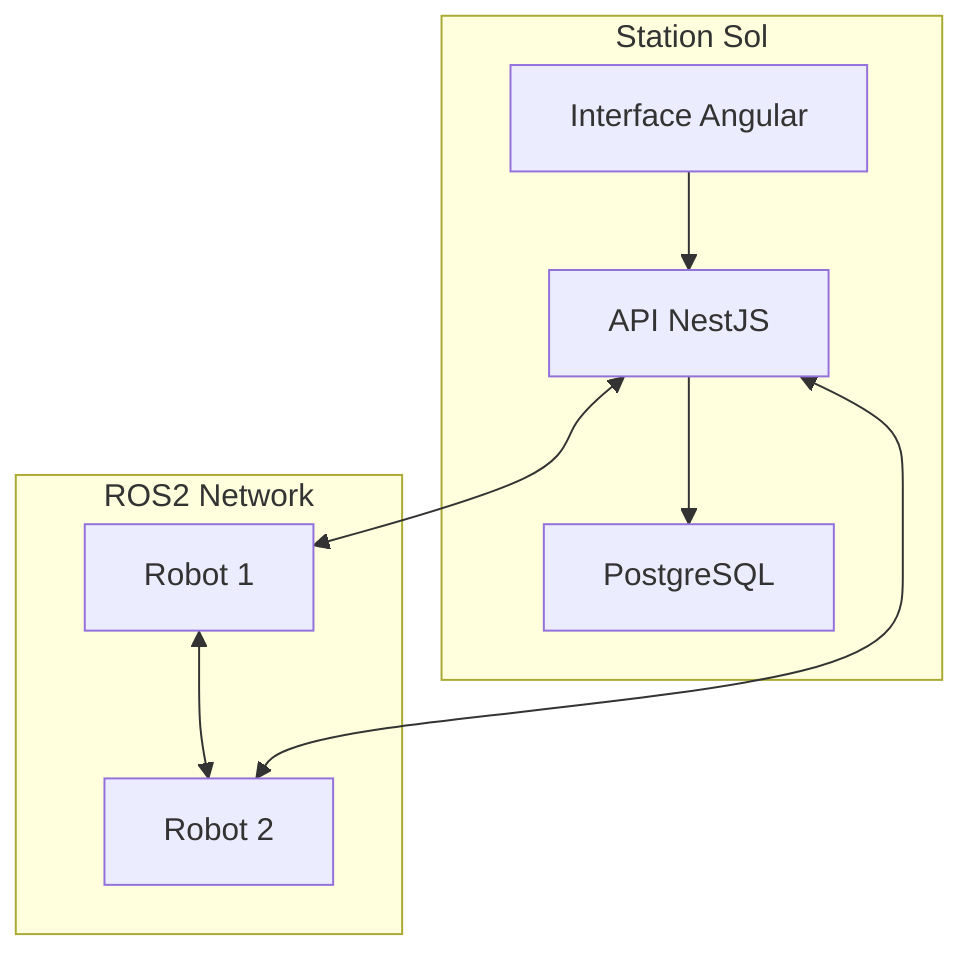
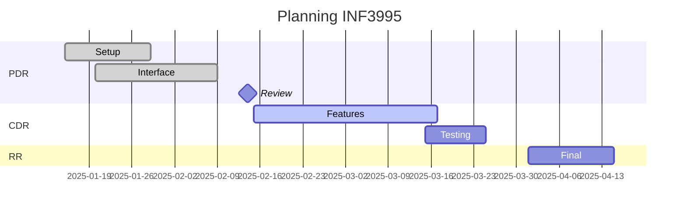

# Département de génie informatique et génie logiciel
**INF3995 - Projet de conception d'un système informatique**

# Documentation du projet répondant à l'appel d'offres no. H2025-INF3995 du département GIGL

## Conception d'un système d'exploration multi-robot
**Équipe No 102**

Zerouali, Amine  
Gratton Fournier, Kevin Santiago  
Haddadi, Issam  
Hachemi Boumila, Rafik  
Abassi, Yassine Mohamed Taha  
Milord, Mario Junior

*Février 2025*

## 1. Vue d'ensemble du projet
### 1.1 But du projet, portée et objectifs (Q4.1)

Le projet dans le cadre du cours INF3995 vise à concevoir, développer et démontrer une preuve de concept d'un système d'exploration multi-robot. En effet, dans l'optique d'une exploration planétaire, plusieurs robots simples et autonomes seront déployés, plutôt qu'un unique robot complexe. Ce système constitué de deux robots permet l'exploration d'une zone donnée, en communiquant entre eux avec une station de contrôle au sol, tout en transmettant les données recueillies vers une interface opérateur. Ce projet se veut une simulation réaliste d'un contrat qui pourrait être passé entre un sous-traitant et une agence spatiale dans le monde du travail.

### 1.2 Hypothèses et contraintes (Q3.1)

#### Hypothèses
- Les robots physiques AgileX Limo fournis seront en bon état
- Les capteurs (IMU, lidar) seront pleinement opérationnels
- Le réseau WiFi assurera une connexion stable
- Le simulateur Gazebo sera fidèle au comportement réel
- Accès aux ressources nécessaires (laboratoire, etc.)

#### Contraintes
1. **Temporelles**
   - PDR : 14 février 2025
   - CDR : 28 mars 2025
   - RR : 15 avril 2025

2. **Ressources**
   - Limite : 630 heures-personnes
   - Accès partagé aux robots
   - Local d'expérimentation avec horaire fixe

3. **Techniques**
   - Docker obligatoire (sauf code embarqué)
   - Exigences techniques strictes
   - Sécurité : utilisation en local uniquement

### 1.3 Biens livrables du projet (Q4.1)

**PDR (14 février 2025)**
- Documentation initiale (GitLab)
- Démo R.F.1 (Identification)
- Démo R.F.2 (Mission Start/Stop)

**CDR (28 mars 2025)**
- Documentation révisée
- Présentation (10 min)
- Démos fonctionnalités

**RR (15 avril 2025)**
- Documentation finale
- Démos complètes
- Tests documentés

## 2. Organisation du projet
### 2.1 Structure d'organisation (Q6.1)

**Équipe de direction**
- **Coordonnateur** : Zerouali, Amine
  - Gestion GitLab
  - Communication client
  - Suivi avancement

**Équipes techniques**
1. **Backend/ROS2**
   - Lead : Gratton Fournier, Kevin
   - Support : Haddadi, Issam
   - ROS2, Gazebo, Docker

2. **Frontend/UX**
   - Lead : Abassi, Yassine
   - Support : Milord, Mario
   - Angular, Tests E2E

3. **Infrastructure**
   - Lead : Hachemi, Rafik
   - CI/CD, Monitoring

### 2.2 Entente contractuelle (Q11.1)

Contrat à prix fixe : 92,560.62 $CAN
- RH : 83,475 $
- Matériel : 9,085.62 $
- Support : 3 mois post-livraison

## 3. Description de la solution
### 3.1 Architecture logicielle générale (Q4.5)



**Stack technique validée**
```yaml
# Technologies
frontend: Angular 16
backend: NestJS
database: PostgreSQL
robotique: ROS2 Humble
simulation: Gazebo Fortress
```

### 3.2 Station au sol (Q4.5)

Architecture en couches :
1. **Frontend** : Angular Material
2. **Backend** : NestJS/Socket.IO
3. **Base de données** : PostgreSQL

### 3.3 Logiciel embarqué (Q4.5)

**ROS2 Nodes**
```python
# Control
├── communication_node
├── navigation_node
└── sensor_node
```

### 3.4 Simulation (Q4.5)

**Gazebo Integration**
```python
# Launch configuration
LaunchDescription([
    Node(package='ros_gz_bridge',
         executable='parameter_bridge')
])
```

### 3.5 Interface utilisateur (Q4.6)

**Components Angular**
```typescript
// Structure
├── DashboardComponent
├── RobotControlComponent
└── MapViewComponent
```

### 3.6 Fonctionnement général (Q5.4)

**Installation**
```bash
# 1. Prérequis
sudo apt install docker-compose ros-humble-desktop

# 2. Démarrage
cd station && docker-compose up
cd robot && ./build_limo1.sh
```

## 4. Processus de gestion
### 4.1 Estimations des coûts (Q11.1)

**Table 1 : Ressources humaines**

| Rôle          | Taux ($/h) | Heures | Coûts ($) |
|---------------|------------|---------|-----------|
| Coordonnateur | 145        | 105     | 15,225    |
| Développeur   | 130        | 525     | 68,250    |
| Total         |            | 630     | 83,475    |

**Table 2 : Matériel**

| Item          | Coût/unité ($) | Qté | Total ($) |
|---------------|----------------|-----|-----------|
| AgileX Limo   | 4,542.81      | 2   | 9,085.62  |

**Total projet : 92,560.62 $CAN**

### 4.2 Planification des tâches (Q11.2)



### 4.3 Contrôle qualité et tests (Q4.4)

**Plan de test**
1. Tests unitaires (Jest/PyTest)
2. Tests intégration ROS2
3. Tests E2E (Cypress)

### 4.4 Gestion de configuration (Q4)

**GitLab CI/CD**
```yaml
stages:
  - build
  - test
  - deploy
```

## 5. Sections futures
### 5.1 Déroulement du projet (Q2.5)
*[CDR et RR seulement]*

### 5.2 Résultats des tests (Q2.4)
*[CDR et RR seulement]*

### 5.3 Travaux futurs (Q3.5)
*[RR seulement]*

### 5.4 Apprentissage continu (Q12)
*[RR seulement]*

### 5.5 Conclusion (Q3.6)
*[RR seulement]*

## Références (Q3.2)

1. [ROS2 Documentation](https://docs.ros.org/)
2. [Angular Material](https://material.angular.io/)
3. [Gazebo](https://gazebosim.org/)
4. [AgileX Robotics](https://www.agilex.ai/)

## Annexes

### A. Configurations système
```yaml
# docker-compose.yml
version: '3.8'
services:
  frontend:
    build: ./client
  backend:
    build: ./server
  db:
    image: postgres:14
```

### B. Structure du projet
```
.
├── client/      # Frontend Angular
├── server/      # Backend NestJS
├── robot/       # Code ROS2
└── simulation/  # Config Gazebo