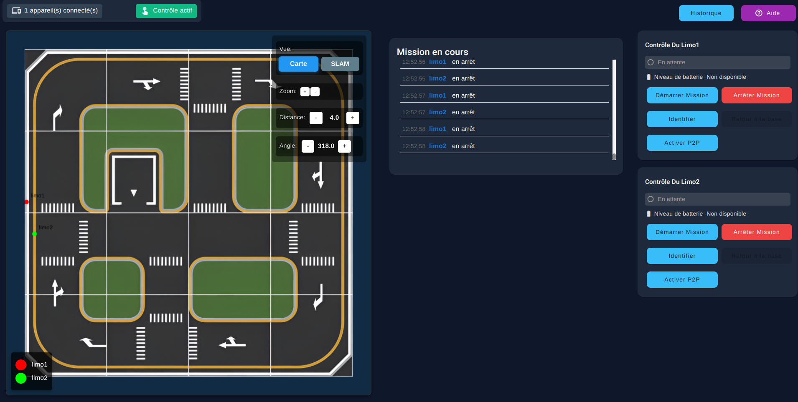
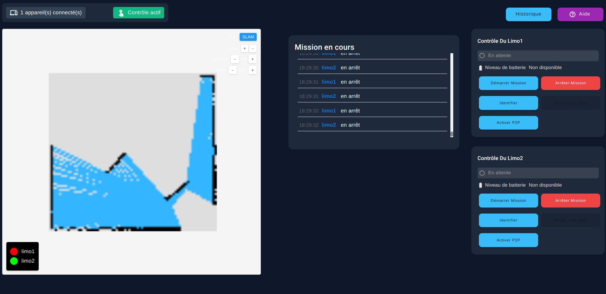
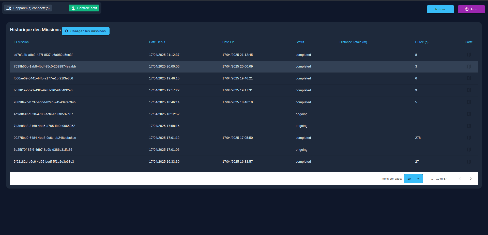
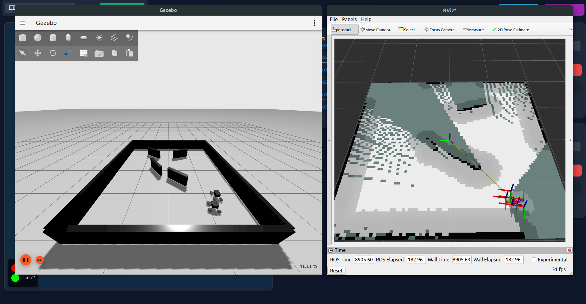

# 🤖 Système d'exploration multi-robot

## Sommaire du projet

Ce projet, réalisé dans le cadre du cours INF3995 à Polytechnique Montréal, vise à concevoir un système complet d'exploration autonome multi-robot. Inspiré d'un contexte spatial, il simule une mission d'exploration de terrain avec deux robots AgileX Limo. Le système est divisé en trois parties principales :

- **Robots physiques**: logiciel ROS 2 Humble
- **Station au sol**: serveur NestJS, base de données MongoDB, interface Angular
- **Simulation**: Gazebo Fortress pour tester sans les robots physiques

L'opérateur interagit via une interface web unifiée pour démarrer, superviser et arrêter les missions. Toutes les composantes, sauf le code embarqué, sont conteneurisées avec Docker.

## 🌟 Fonctionnalités du robot

- Démarrage/arrêt de mission depuis l'interface web
- Navigation autonome avec évitement d'obstacles
- Cartographie 2D en temps réel visible sur l'interface
- Sauvegarde des missions en base de données (PostgreSQL)
- Communication directe inter-robots (P2P)

## 🗂️ Structure du projet

```
.
├── client/                     # Interface utilisateur Angular
├── server/                     # Serveur NestJS + PostgreSQL
├── robot/
│   ├── common/                 # Fichiers partagés entre robots (son, images, ...)
│   ├── gazebo/                 # Modèles et monde Gazebo
│   ├── gazebo_launch_scripts/  # Scripts pour le lancement séparé de la simulation
│   ├── limo/                   # Code spécifique au robot Limo
│   ├── limo_launch_scripts/    # Scripts pour le lancement séparé des limos
│   ├── robot/                  # Comportement embarqué des robots (navigation, communication, identification, ...)
│   ├── robot_launch_scripts/   # Scripts pour le lancement séparé de comportement embarqué
│   └── utilities/              # Scripts d'installation, débogage
├── docker-compose.yml          # Lancement station avec Docker
├── Dockerfile                  # Construction du conteneur
├── start_base.sh               # Script de démarrage de la station au sol (Fronend, Backend)
├── start_docker.sh             # Lance l'environnement complet avec Docker
├── start_gazebo.sh             # Lance simulation Gazebo (Frontend, Backend, Gazebo)
├── start_install.sh            # Installe dépendances nécéssaires
├── START.md                    # Instructions d’utilisation (voir ci-dessous)
```

## 📸 Images du projet

### Interface Web


### Gérération de map


### Base de donnée


### Simulation Gazebo


## ⚙️ Installation et exécution
Veuillez consulter le fichier `START.md` à la racine du projet. Celui-ci contient :

- Prérequis pour Ubuntu 22.04 (ou WSL2)
- Commandes pour lancer le projet avec `docker-compose`
- Instructions pour un lancement local (hors Docker)
- Détails pour lancer la simulation Gazebo avec ou sans robots

Lien rapide : [START.md](./START.md)

## 👥 Équipe 102
Zerouali, Amine  
Gratton Fournier, Kevin Santiago  
Haddadi, Issam  
Hachemi Boumila, Rafik  
Abassi, Yassine Mohamed Taha  
Milord, Mario Junior
   
## 🛠️ Technologies utilisés


