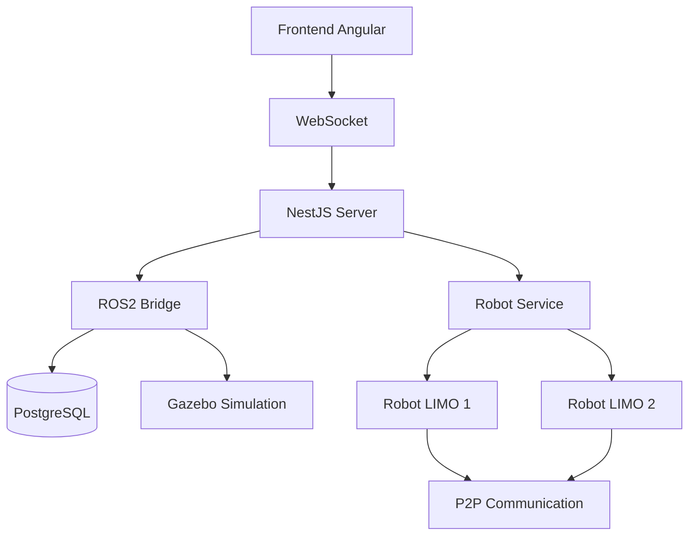
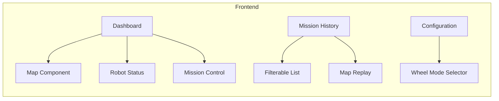
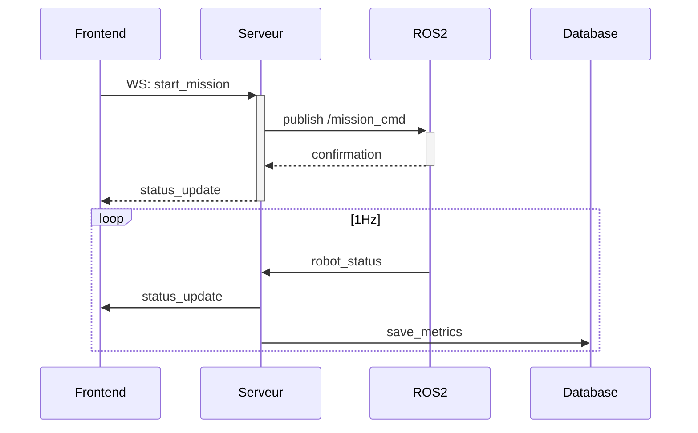
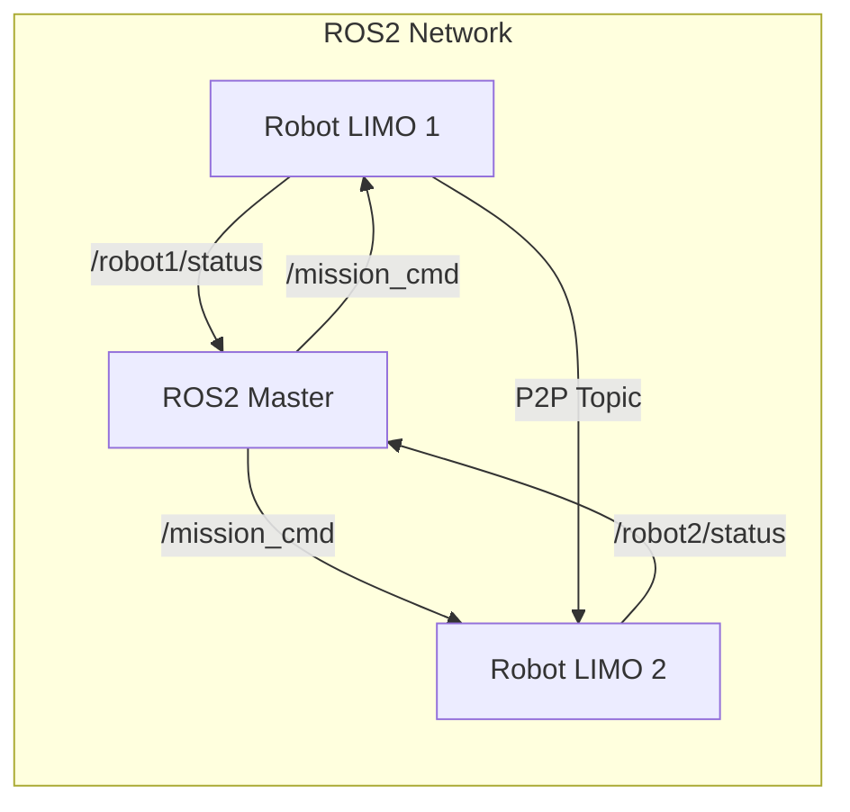
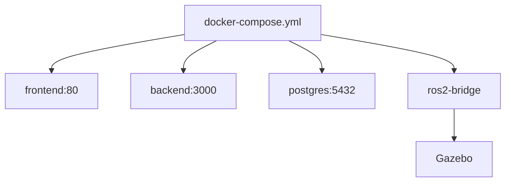
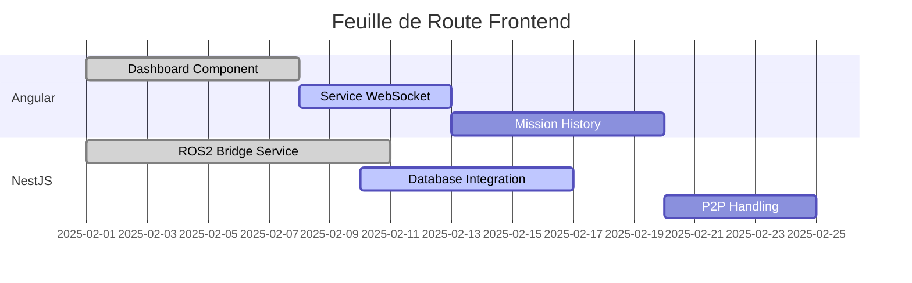

# Architecture du Système Multi-Robot



## 1. Architecture Client-Serveur

### 1.1 Frontend Angular


**Fonctionnalités Clés :**
- Visualisation temps réel avec WebSocket (1Hz minimum)
- Gestion des missions (start/stop/return)
- Historique avec filtrage (R.F.17)
- Affichage cartes sauvegardées (R.F.18)
- Sélection mode roues (R.F.15)

### 1.2 Serveur NestJS


**Composants Serveur :**
- WebSocket Gateway
- ROS2 Bridge Service (rclnodejs)
- Mission Service
- Database Module (TypeORM)

## 2. Intégration ROS2

### 2.1 Communication Robot-Serveur


**Topics Clés :**
- `/robot*/status` : Position, batterie, mode
- `/mission_cmd` : Commandes haut niveau
- `/p2p_communication` : Échange direct robot-robot (R.F.19)

## 3. Déploiement Docker



**Configuration Type :**
```yaml
services:
  frontend:
    build: ./client
    ports: ["80:80"]
    
  backend:
    build: ./server
    environment:
      ROS_DOMAIN_ID: 27
    depends_on: [postgres]

  postgres:
    image: postgres:15
    volumes: [postgres_data:/var/lib/postgresql/data]

  ros2-bridge:
    image: ros:humble
    command: ros2 launch exploration_bringup robot.launch.py
```

## 4. Conformité aux Exigences

| Exigence | Composant | Implémentation |
|----------|-----------|----------------|
| R.F.15 | Frontend | Sélecteur mode roues → Service ROS2 |
| R.F.17 | Serveur | PostgreSQL + TypeORM |
| R.F.18 | Frontend | Leaflet.js + historique missions |
| R.F.19 | ROS2 | Topic P2P dédié |
| R.C.2 | DevOps | docker-compose unique |
| R.Q.1 | Global | ESLint + Prettier config |

## 5. Workflow de Développement



**Prochaines Étapes :**
1. Finaliser l'intégration WebSocket
2. Implémenter le replay de carte historique
3. Tester la communication P2P entre robots